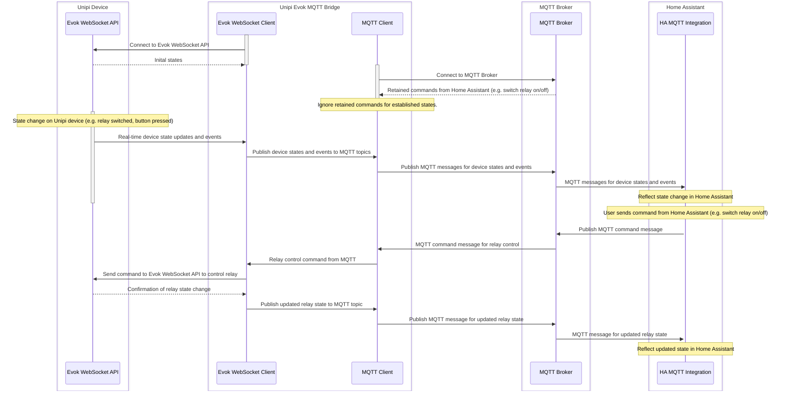

# unipi-mqtt-ng

[](https://github.com/blackbit-consulting/unipi-mqtt-ng/actions/workflows/build.yml) [](https://github.com/blackbit-consulting/unipi-mqtt-ng/actions/workflows/github-code-scanning/codeql)

# About Unipi Evok to MQTT bridge for Home Assistant

This application bridges a Unipi device running Evok to an MQTT broker,
enabling smart home automation and monitoring via [**Home Assistant**](https://www.home-assistant.io/).
It is written in TypeScript and uses a YAML configuration file for setup.

It needs to connect to the Unipi Evok WebSocket API to receive
real-time updates on device states and events.
It will then publish this information to specified MQTT topics.
The application also allows for controlling relays
and monitoring inputs based on the configuration.

# Concept
This mermaid sequence diagram should clarify the concept of the application and how it interacts with Evok on the left hand
and MQTT on the right hand.


# Features

- Connects to Unipi Evok via WebSocket
  - Runs on node as of 20 on Unipi Neuron devices (on Debian Buster), and preferably connects over localhost
- Publishes device states and events to MQTT topics, allowing Home Assistant to subscribe and react to changes
- Allows control of relays via MQTT commands, enabling Home Assistant to send commands to the Unipi device
- Supports device discovery by Home Assistant via MQTT
- States are retained in MQTT, ensuring Home Assistant can retrieve the last known state upon startup or reconnection
- Supports relays and inputs configuration
  - Supports both pulse relay mode and regular relay mode
  - Supports buttons with single, double, triple and long press, as well as repeat events.
- Easy YAML-based configuration
- Persistence of Pulse relay states across restarts or upon power loss (can be deactivated)
    - Optimized to minimize write operations to the Unipi device, ensuring longevity of the hardware
- Maintenance mode switch for correcting pulse relay states without affecting the actual relay.

# Runs on Unipi Neuron devices directly
This software was developed to be run on a Unipi Neuron device, which is a small industrial Raspberry Pi based unit
designed to be mounted on a DIN rail in an electrical cabinet. It runs a Debian-based Linux distribution and has
built-in support for analog and digital inputs, relays, one-wire, and more.

> I **recommend** running the directly on the Unipi device. This way you can use the localhost interface to connect to the 
> Evok WebSocket API, which is both more efficient and more secure. If you run it on a separate machine, you will need
> to configure the Evok API to allow remote connections. This also introduces additional latency, which is especially
> relevant if you are using pulse relays, as the timing of the pulses affects their switching behavior.
>
> It is also possible to run the application on a separate machine or in a docker container if you prefer.

### Requirements

#### Node.JS
You need Node.JS 20 installed on the Unipi device. You can install it via the NodeSource repository:

#### Evok API
You need to have the Evok API running on the Unipi device. This is usually the case by default, but you can check it 
by running the following command:

#### Systemd or another process manager (optional, but recommended)
You can run the application directly in the terminal, but it is recommended to use a process manager
like systemd or [pm2](https://pm2.keymetrics.io/) to manage the application as a service.
This way it can be automatically started on boot and restarted. As [systemd](https://systemd.io/) comes with Debian, it is the recommended
option.

# Relay support

## Relays vs Pulse-Relays?
Instead of directly using the relays to switch mains, I recommend using the Unipi relays to switch a **low voltage circuit**
which then controls a so-called teleruptor or pulse-relay that in turn switches the mains.
This way you can consider the entire Unipi system as low voltage which is safer to work with and does not require a
certified electrician for installation.
This is also more power efficient and better for the longevity of the hardware,
as it minimizes the time the relay is energized.
Last, but not least, these pulse relays keep their state during a power loss and allow you to switch both the N and L
lines, which is again safer.

> **Note**
> 
> The applications has optimized support for writing state to the Unipi devices on an as-needed basis, with an interval.
> This prevents additional writes to the Unipi device when the state is already in the desired state,
> which can cause wear and tear on the SSD memory of the device.

### Pulse relay mode
In order to enable pulse relay mode, you need to set the `pulse` option to `true` for the relay in the configuration
file. This will cause the application to send a short pulse to the relay when it receives a command to switch it on or
off. The duration of the pulse can be configured with the `pulseDuration` option (in milliseconds).

The application tracks the effective state changes of the pulse relay via received evok messages, and uses this to update
the internal state.

#### Maintenance mode for pulse relays
In case the state of the pulse relay gets out of sync with the internal state (e.g. due to a missed message
or a manual switch of the pulse relay), you can use the maintenance mode to correct the state. Just toggle the
maintenance mode on, and then use home assistant (or Homekit) to toggle the device state. This will update the internal
state of the relay in the application without sending a command to the Unipi device, so that the next time you toggle
the relay, it will be in sync again.


#### Configuration example for a regular vs a pulse relay
```yaml
logLevel: info # The log level. Can be set to debug, info, warn or error. Default is info.
evok:
  id: myUnipiDevice # The ID of the Unipi device, used in MQTT topic names. Should be unique if you have multiple Unipi devices.
  options: # Options for the Evok device
    version: v2 # The version of the Evok API to use. This can be used to support both Evok v2 and Evok v3, which have some differences in messages and types. Default is v2.
    pulseDurationMs: 200 # The duration that the pulse relay needs to be energized to switch its state.
    persistPulseRelayStates: true # Whether to persist the state of pulse relays across restarts or power loss.
    persistPulseRelayStatesMinIntervalMs: 10000 # The minimum interval between state writes to the Unipi device.
    persistPulseRelayStatesTo: "/var/unipi-mqtt/state.json" # Example of where to persist the state of the pulse relays.
  relays: # Unipi Relays to configure. Unconfigured relays will be ignored by the application.
    - id: relayLivingRoomLight # MUST BE UNIQUE IN RELAYS
      name: Living Room Light # Name as advertised on MQTT and used as default in Home Assistant
      pulse: true # This is a pulse relay, so the application will send a short pulse to switch it on or off.
      as: light # Expose this device as a light, fan or switch (default) in Home Assistant.
    - id: relayBathroomFan # MUST BE UNIQUE IN RELAYS
      name: Bathroom Fan # Name as advertised on MQTT and used as default in Home Assistant
      pulse: false # This is a regular relay, so the application will send a command to switch it on or off.
      as: fan # Expose this device as a fan, light or switch (default) in Home Assistant.
```
The application will then keep track of the virtual state of the pulse relay (as the real relay goes HIGH then LOW).
The application will persist these states to a file, so that they can be restored upon restart or after a power loss.

# Input Support
The application also supports monitoring of inputs. You can configure the inputs in the configuration file, either as
regular inputs (with HIGH/LOW states), or as momentary buttons.

## Regular inputs
For regular inputs, the application will publish the (retained) state of the input to the MQTT broker whenever it
changes. You can then use this information in Home Assistant to trigger automations or to display the state of the input.

### Sample configuration for a regular input
```yaml
evok:
  inputs: # Unipi Inputs to configure. Unconfigured inputs will be ignored by the application.
    - id: inputFrontDoor # MUST BE UNIQUE IN INPUTS
      name: Front Door # Name as advertised on MQTT and used as default in Home Assistant
      circuit: 1_01 # The circuit of the input, in the format {module}_{circuit}, e.g. 1_01 for module 1, circuit 1.
      button: false # This is a regular input, so the application will publish its state to MQTT.
      # as: contact # PENDING FEATURE - Expose this device as a specific type of sensor in Home Assistant, e.g. contact for a door sensor. By default, it will be exposed as a binary sensor.
```

## Button inputs
For button inputs, the application will publish retained state message to the MQTT broker whenever the button is either
DOWN or UP, as well as various press events:

* **single_press**
  For  when the button is pressed and released within a short time (e.g. 500ms). This can be configured using the
  `maxNextPressDelayMs` option.
  * **double_press**
    For when the button is pressed and released several times repeatedly, with a short delay between the presses
    (e.g. 500ms). This can be configured using the `maxNextPressDelayMs` option.
* triple_press - Equivalent to double_press, but for three presses.
* long_press - For when the button is pressed and held for a longer time (e.g. 1000ms). This can be configured using the
  `longPressDurationMs` option.
* repeat - When the button remains down after the long press event, every 500ms by default. Can be configured using the `maxRepeatedPressDelayMs` option.
* 

### Sample configuration for a momentary button input

```yaml
evok: # Evok section
  options: # Options for the Evok device
    # The duration that the pulse relay needs to be energized to switch its state.
    pulseDurationMs: 200
    # The interval between repeat events for a button that remains pressed after the long press event. Default is 500ms.
    maxRepeatedPressDelayMs: 300 # Recommended value
    # The max delay between a UP and consecutive DOWN event for a button for it to be considered as a next press in seqence
    # If released for longer than this duration, the event will fire and then start fresh from the next DOWN event.
    maxNextPressDelayMs: 450
    # Ensure that pulse relay states are preserved in between reboots or upon power loss.
    persistPulseRelayStates: true
    # Save states at most once every 10s, and ony if the state changed.
    persistPulseRelayStatesMinIntervalMs: 10000
    # Where to persist the state to. Use an absolute path.
    persistPulseRelayStatesTo: "/root/state.json"
    
  id: myUnipiDevice # The ID of the Unipi device, used in MQTT topic names. Should be unique if you have multiple Unipi devices.
  inputs: # Unipi Inputs to configure. Unconfigured inputs will be ignored by the application.
    - id: buttonLivingRoom # MUST BE UNIQUE IN INPUTS
      name: Living Room Button # Name as advertised on MQTT and used as default in Home Assistant
      circuit: 1_02 # The circuit of the input, in the format {module}_{circuit}, e.g. 1_02 for module 1, circuit 2.
      button: # This is a button input, so the application will publish press events to MQTT.
```

# Installation
### Prepare Home Assistant

The only required step is to install the [MQTT integration](https://www.home-assistant.io/integrations/mqtt/) in
Home Assistant. The integration will propose to setup a new MQTT broker if needed, running as an app (add-on) in
Home Assistant (a container running Mosquitto). You can also use an existing MQTT broker if you have one, but using the
add-on is the easiest way to get started.

### Install the Unipi Evok MQTT Bridge

Install the package on your Unipi Device (preferred) or on a separate machine that can access the Unipi device and the
MQTT broker.

> Note: Installing on Unipi will allow you to use the localhost interface for communication with Evok.
> This is both more efficient and more secure.

Attention: You SHOULD NEVER install Node.JS applications under the root user. Instead, use a non-root user with the
appropriate permissions to access the configuration file and optional persistence file.
This is important for security reasons, as any vulnerabilities in the application could be exploited to gain root access
to the system if it is run as root.

> Note
> 
> This installation assumes there is a 'unipi' user on the system.
> This is normally the case if you started from Unipi's official base os.

#### Configure user (exceptional)
```bash
# Check if the unipi user exists or create it
id unipi || sudo useradd -m -s /bin/bash unipi # Will also create the group

# Add the user to the sudo group if you want to allow it to install Node.JS and the application without switching users
sudo usermod -aG sudo unipi

# Switch to the unipi user
sudo -i -u unipi # Or su - unipi if you are root
```

#### First, install Node.JS 20.x using sudo from the NodeSource repository:
```bash
# Check if installed first
node --version

# If not, install. This will invoke sudo, so you can run it as the unipi user.
sudo apt-get install -y curl
curl -fsSL https://deb.nodesource.com/setup_20.x | sudo -E bash -
sudo apt-get install -y nsolid
nsolid -v
```

#### Then,
```bash
# Setup a local non-root prefix for globally installed npm packages
# This will prevent npm from attempting to install in the system directories which would require root permissions.
mkdir -p ~/.npm-global
npm config set prefix '~/.npm-global'

# Tell NPM to find the packages in the github npm registry
echo '@blackbit-consulting:registry=https://npm.pkg.github.com' >> ~/.npmrc

# Add the bin location to your path via bash profile
echo 'export PATH=~/.npm-global/bin:$PATH' >> ~/.bashrc
source ~/.bashrc

# Install EITHER via the NPM registry
npm install -g @blackbit-consulting/unipi-mqtt-ng

# OR install via the downloaded release file from GitHub
npm install -g /path/to/blackbit-consulting-unipi-mqtt-ng-x.y.z.tgz
```

Upon installation, a shell script link (`unipi-evok-mqtt`) is created.
You can directly invoke this script to run the application:

#### Testing the application with a configuration file
```bash
unipi-evok-mqtt [/some/dir/config.yaml] [--validate]
```

The application can be stopped with a simple `CTRL+C` in the terminal, equivalent to sending a `SIGINT` signal to 
the process. f you want to run it as a background service, you can use tools like `pm2` or `systemd` to manage the
process.

#### Create a systemd Service File

```
[Unit]
Description=Unipi Evok MQTT Bridge
After=network.target

[Service]
# Make sure to configure the proper path
ExecStart=/usr/bin/unipi-evok-mqtt /path/to/config.yaml
KillSignal=SIGINT # By default, systemd sends SIGTERM, but we want to send SIGINT to allow the application to save state.
Restart=always
# Note that the user/group must have access to config file and optional persistence file
User=unipi
Group=unipi

[Install]
WantedBy=multi-user.target
```

##### Enabling (for boot time)

```bash
sudo systemctl daemon-reload # Tell systemd to reload unit files
sudo systemctl enable unipi-evok-mqtt.service # Enable the service to start on boot
```

#### First start

```bash
sudo systemctl start unipi-evok-mqtt.service # Start
sudo systemctl status unipi-evok-mqtt.service # Check status
```

#### Stopping - if needed

```bash
sudo systemctl stop unipi-evok-mqtt.service
```

#### Tailing the logs

```bash
sudo journalctl -u unipi-evok-mqtt.service -f
```

#### Restarting (for reloading configuration changes)

> I recommend running a validation first!

```bash
sudo systemctl restart unipi-evok-mqtt.service
```

#### Configuration

All settings are managed via a yaml configuration file. This file defines MQTT connection details, Evok device
options, and the list of relays and inputs to manage. The yaml file is validated agains a json schema at startup,
or when using The `--validate` option. You can also obtain the schema here:

[Link to the latest JSON schema](./config/config-schema-v1.yaml)

#### Example `config.yaml`

```yaml
# Refer to the schema for validation in an editor
$schema: https://blackbit.be/schemas/unipi-evok-mqtt/v1/config
# Log level prevents extra logging in production. Defaults to info.
loglevel: info # debug | info | warn | error
mqtt: # The MQTT configuraiton section
  brokerUrl: mqtt://my-home-assistant:1883 # Sample does not use SSL. Use mqtts:// for SSL connection if possible.
  # The client ID to use when connecting to the MQTT broker.
  # Should be unique if you have multiple instances of the application running.
  clientId: evok-mqtt-dev
  # The username for connection to the MQTT broker. Configure in MQTT broker settings in Home Assistant.
  username: unipi-dev
  # The password for connection to the MQTT broker. Configure in MQTT broker settings in Home Assistant.
  password: xv*ZCgCBhB.@8B_KK_Uoq!Za*D*J2U@j
evok: # The Evok configuration section
  id: myEvokDevice1 # The evok id, must be unique if you have multiple devices. Determines the topic names.
  options: # Options for the Evok device
    version: v2 # The version of the Evok API to use. This can be used to support both Evok v2 and Evok v3, which have some differences in messages and types. Default is v2.
    pulseDurationMs: 200 # The duration that the pulse relay needs to be energized to switch its state.
    maxRepeatedPressDelayMs: 300 # The interval between repeat events for a button that remains pressed after the long press event. Default is 500ms.
    maxNextPressDelayMs: 450 # The max delay between a UP and consecutive DOWN event for a button for it to be considered as a next press in seqence. If released for longer than this duration, the event will fire and then start fresh from the next DOWN event.
    persistPulseRelayStates: true # Ensure that pulse relay states are preserved in between reboots or upon power loss.
    persistPulseRelayStatesMinIntervalMs: 10000 # Save states at most once every 10s, and ony if the state changed.
    persistPulseRelayStatesTo: "/home/unipi/state.json" # Where to persist the state to. Use an absolute path.
  websocketUrl: ws://127.0.0.1/ws # Use localhost if possible
  devices: # The devices to configure. Unconfigured devices will be ignored by the application.
    relays: # Unipi Relays to configure. Unconfigured relays will be ignored by the application.
      - id: sampleBathroomFan
        dev: relay
        relayType: physical
        name: bathroom fan
        circuit: 2_01
        pulse: true
        as: fan
      - id: sampleBathroomLights
        name: bathroom lights
        dev: relay
        relayType: physical
        circuit: 2_02
        pulse: true
        as: light
      - id: sampleBathroomMirrorHeating
        name: bathroom mirror heating
        dev: relay
        relayType: physical
        circuit: 2_03
        as: switch
    inputs: # The inputs section
      - id: sampleBathroomFanButton
        name: bathroom fan button
        dev: input
        circuit: 1_04
        button: true
      - id: sampleBathroomLightsButton
        name: bathroom lights button
        dev: input
        circuit: 2_08
        button: true
      - id: sampleContactSensorInput
        name: bathroom contact sensor
        dev: input
        circuit: 2_09
```

# License
This software is licensed under the MIT License, which allows for free use, modification, and distribution.
For more details, please refer to the LICENSE file in the repository.
See [LICENSE](./LICENSE)

# Disclaimer
This software is provided "as is", without warranty of any kind, express or implied, including
but not limited to the warranties of merchantability, fitness for a particular purpose and non-infringement.
In no event shall the authors or copyright holders be liable for any claim, damages or other liability,
whether in an action of contract, tort or otherwise, arising from, out of or in connection with the software or
the use or other dealings in the software.

